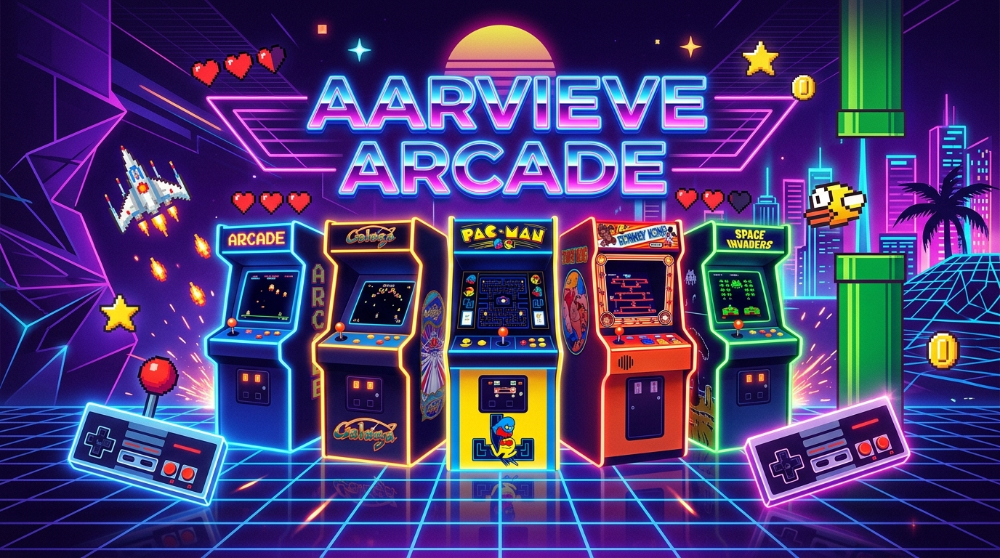

# 🕹️ Aarvieve Arcade ❤️

<p align="center">
  
</p>

<p align="center">
  <strong>A modern, Y8-inspired retro arcade platform crafted for couples & casual gamers.</strong><br />
  Play nostalgic mini-games, compete on live leaderboards, unlock achievements, and celebrate milestones together.
</p>

<p align="center">
  <a href="https://react.dev/"></a>
  <a href="https://www.typescriptlang.org/"></a>
  <a href="https://vite.dev/"></a>
  <a href="https://tailwindcss.com/"></a>
  <a href="https://firebase.google.com/"></a>
  <a href="https://phaser.io/"></a>
  <a href="https://www.framer.com/motion/"></a>
</p>

---

## 📖 Table of Contents

- [✨ Features](#-features)
- [🎮 15 Built-in Arcade Mini-Games](#-15-built-in-arcade-mini-games)
- [🛠️ Tech Stack & Architecture](#️-tech-stack--architecture)
- [🚀 Quick Start & Local Setup](#-quick-start--local-setup)
- [⚙️ Environment Configuration](#️-environment-configuration)
- [📦 Project Directory Structure](#-project-directory-structure)
- [🌐 Deployment](#-deployment)
- [🖼️ Social Sharing & Open Graph](#️-social-sharing--open-graph)
- [🤝 Contributing & License](#-contributing--license)

---

## ✨ Features

- 🕹️ **15 Retro & Cozy Mini-Games**: Handcrafted arcade classics with responsive canvas physics, smooth controls, and CRT scanline aesthetics.
- 🏆 **Global & Per-Game Leaderboards**: Real-time high-score tracking powered by Firebase Firestore, with offline mock fallback.
- 💖 **Couple Memories & Gallery Timeline**: Upload and preserve photos, milestones, and romantic memories with instant cloud synchronization.
- 🎖️ **Retro Achievement System**: Unlock special badges, perfectionist trophies, and hidden easter eggs as you play.
- 👤 **Customizable Player Profiles**: Personal avatars, level progression, XP calculations, and detailed game statistics.
- 📱 **Progressive Web App (PWA)**: Full offline service worker caching and installable app manifest for mobile and desktop play.
- 🎨 **State-of-the-Art Aesthetic**: Deep purple synthwave palette, neon glows, glassmorphism cards, pixel typography, and fluid Framer Motion transitions.

---

## 🎮 15 Built-in Arcade Mini-Games

| Game | Category | Difficulty | Description | Controls |
| :--- | :--- | :--- | :--- | :--- |
| 🐦 **Flappy Bird** | Retro Arcade | Hard | Dodge pipes and navigate through gravity physics. | `Space` / `Click` / `Tap` |
| 🐍 **Snake** | Retro Classic | Medium | Classic grid-based snake with food combos and speed ramps. | `Arrow Keys` / `WASD` / `D-Pad` |
| 🧱 **Brick Breaker** | Action Arcade | Medium | Break power-up bricks with paddle rebounds and ball physics. | `Mouse` / `Arrow Keys` / `Touch Drag` |
| 🚀 **Space Dodger** | Sci-Fi Arcade | Hard | Pilot your ship through meteor storms and laser hazards. | `Arrow Keys` / `WASD` / `Touch` |
| 🦕 **Dino Run** | Endless Runner | Hard | Jump over cacti and pterodactyls in a high-speed desert run. | `Space` / `Up Arrow` / `Tap` |
| 🧩 **2048 Puzzle** | Brain / Cozy | Hard | Slide numbered tiles to merge them up to the legendary 2048 tile. | `Arrow Keys` / `Swipe Gestures` |
| 🧠 **Memory Cards** | Puzzle / Cozy | Medium | Match pairs of cards with time bonuses and combo streaks. | `Mouse Click` / `Touch` |
| 👁️ **Neon Sequence** | Simon Says | Medium | Memorize and repeat escalating sequences of glowing neon colors. | `Mouse Click` / `Touch` |
| 🔢 **Sudoku** | Logic / Brain | Hard | Classic 9x9 numerical grid logic with difficulty presets and hints. | `Mouse Click` / `Numpad` |
| ❌ **Tic Tac Toe** | Strategy | Easy | Play against smart Minimax AI or 2-player local mode. | `Mouse Click` / `Touch` |
| 🐛 **Whack-A-Bug** | Fast Reflex | Easy | Whack pop-up arcade bugs before they disappear underground. | `Mouse Click` / `Tap` |
| ⚡ **Reaction Clicker** | Reflex Trainer | Hard | Test your human reflex speed down to the millisecond. | `Click` / `Tap` on visual flash |
| 🧺 **Catch My Heart** | Cozy Arcade | Easy | Catch falling hearts and sweet gifts while dodging rainclouds. | `Mouse Move` / `Arrow Keys` |
| 🎯 **Arcade Trivia** | Cozy Trivia | Medium | Couple & arcade trivia questions with timed answers and scoring. | `Multi-Choice Selection` |
| 🥤 **Cup Shuffle** | Visual Focus | Medium | Follow the shell-game cup shuffle and find the hidden gold coin. | `Mouse Click` / `Tap` |

---

## 🛠️ Tech Stack & Architecture

- **Frontend Framework**: [React 19](https://react.dev/) + [Vite](https://vite.dev/) + [TypeScript](https://www.typescriptlang.org/)
- **Styling & UI**: [Tailwind CSS v4](https://tailwindcss.com/) + Custom Arcade Design Tokens + [Lucide Icons](https://lucide.dev/)
- **Animation & FX**: [Framer Motion](https://www.framer.com/motion/) + [Canvas Confetti](https://github.com/catdad/canvas-confetti)
- **Game Engines & Physics**: HTML5 Canvas 2D API + [Phaser.js 4](https://phaser.io/)
- **State Management**: [Zustand](https://github.com/pmndrs/zustand) (Client state, session history, active game states)
- **Backend & Cloud Services**: [Firebase 12](https://firebase.google.com/) (Auth, Firestore, Cloud Storage)
- **PWA & Offline Support**: Custom Service Worker (`sw.js`) + Web App Manifest + Mock Backend Fallback

---

## 🚀 Quick Start & Local Setup

### Prerequisites
- **Node.js**: v18.0+ or v20.0+ installed
- **npm** or **pnpm** / **yarn**

### 1. Clone the repository
```bash
git clone https://github.com/EYRON27/AarvieveArcade.git
cd AarvieveArcade
```

### 2. Install dependencies
```bash
# Install workspace dependencies
npm install
```

### 3. Configure Environment Variables
Copy the example environment file into the client app:
```bash
cd client
cp .env.example .env
```
*(Optionally provide your Firebase credentials or leave default `VITE_USE_MOCK_FIREBASE=true` to test completely offline without Firebase)*.

### 4. Start Development Server
```bash
# From the root directory or inside /client:
npm run dev
```
Open your browser at `http://localhost:5173` to explore Aarvieve Arcade!

---

## ⚙️ Environment Configuration

Configuration variables are stored in `client/.env`:

| Variable | Type | Description | Default / Example |
| :--- | :--- | :--- | :--- |
| `VITE_USE_MOCK_FIREBASE` | `boolean` | Set `true` to run completely offline without Firebase setup | `false` |
| `VITE_FIREBASE_API_KEY` | `string` | Firebase Web API Key | `AIzaSy...` |
| `VITE_FIREBASE_AUTH_DOMAIN` | `string` | Firebase Auth Domain | `aarvieve-arcade.firebaseapp.com` |
| `VITE_FIREBASE_PROJECT_ID` | `string` | Firebase Project ID | `aarvieve-arcade` |
| `VITE_FIREBASE_STORAGE_BUCKET` | `string` | Firebase Cloud Storage Bucket | `aarvieve-arcade.appspot.com` |
| `VITE_FIREBASE_MESSAGING_SENDER_ID` | `string` | Firebase Cloud Messaging Sender ID | `1234567890` |
| `VITE_FIREBASE_APP_ID` | `string` | Firebase Application ID | `1:1234567890:web:...` |

---

## 📦 Project Directory Structure

```text
AarvieveArcade/
├── client/
│   ├── public/
│   │   ├── gallery/               # Cached screenshot & memory previews
│   │   ├── manifest.json          # PWA configuration manifest
│   │   ├── og-image.jpg           # High-resolution (1280x720) social preview banner
│   │   ├── og-image.png           # PNG fallback for social link unfurling
│   │   └── sw.js                  # Service worker for offline asset caching
│   ├── src/
│   │   ├── assets/                # Logos, SVG icons, and hero graphics
│   │   ├── components/            # Reusable UI components (Navbar, Modal, HUD, Cabinet)
│   │   ├── contexts/              # Authentication & User Session contexts
│   │   ├── games/                 # 15 Independent arcade mini-games
│   │   │   ├── brickBreaker/
│   │   │   ├── catchMyHeart/
│   │   │   ├── cupShuffle/
│   │   │   ├── dinoRun/
│   │   │   ├── flappyBird/
│   │   │   ├── memoryGame/
│   │   │   ├── neonSequence/
│   │   │   ├── puzzle2048/
│   │   │   ├── reactionGame/
│   │   │   ├── snake/
│   │   │   ├── spaceDodger/
│   │   │   ├── sudoku/
│   │   │   ├── ticTacToe/
│   │   │   └── whackABug/
│   │   ├── pages/                 # Full-page views (Dashboard, GameRoom, Leaderboard, Memories)
│   │   ├── services/              # Firebase & Mock Database service layers
│   │   ├── store/                 # Zustand global application state stores
│   │   ├── types/                 # TypeScript type declarations & interfaces
│   │   ├── App.tsx                # App root & React Router configuration
│   │   └── index.css              # Tailwind CSS directives & retro glow utilities
│   ├── index.html                 # HTML shell with full SEO & Open Graph meta tags
│   ├── package.json               # Client dependencies & build scripts
│   ├── tsconfig.json              # TypeScript compilation settings
│   ├── vercel.json                # Single-page-app routing rewrite configuration
│   └── vite.config.ts             # Vite bundler plugins & build configuration
├── package.json                   # Root workspace manifest
└── README.md                      # Project documentation
```

---

## 🌐 Deployment

### Deploy to Vercel (Recommended)
[](https://vercel.com/new)

1. Import this repository into **Vercel**.
2. Set **Root Directory** to `client`.
3. Set **Framework Preset** to `Vite`.
4. Build Command: `npm run build`, Output Directory: `dist`.
5. Add your Firebase environment variables in the Vercel Dashboard under **Project Settings > Environment Variables**.

### Deploy to Netlify / Render
- **Build Command**: `npm run build`
- **Publish / Output Directory**: `client/dist`
- **SPA Rewrites**: Handled automatically via `client/vercel.json` or create a `client/public/_redirects` file with `/*  /index.html  200`.

---

## 🖼️ Social Sharing & Open Graph

This project is configured with complete **Open Graph (`og:*`)** and **Twitter Cards (`twitter:*`)** metadata in `client/index.html`.

### Why didn't LinkedIn show a thumbnail previously?
1. **Missing `og:image` Tag**: LinkedIn's post crawler requires an explicit `<meta property="og:image" content="..." />` tag in the `<head>` of `index.html`.
2. **Missing Dimensions & Card Type**: LinkedIn crawlers expect `og:image:width`, `og:image:height`, and `og:type` to render rich preview cards.
3. **LinkedIn Cache**: LinkedIn caches URL scrape data for up to 7 days.

### How to refresh LinkedIn preview immediately:
1. Deploy your latest changes with the updated `index.html` and `public/og-image.jpg`.
2. Open the **[LinkedIn Post Inspector](https://www.linkedin.com/post-inspector/)**.
3. Paste your live deployment URL (e.g. `https://your-arcade.vercel.app`) and click **Inspect**.
4. LinkedIn will instantly clear its cache and show your high-resolution neon arcade banner!

---

## 🤝 Contributing & License

Contributions, game ideas, and pull requests are welcome!

Distributed under the **MIT License**. Created with ❤️ by [Aaron](https://github.com/EYRON27).
